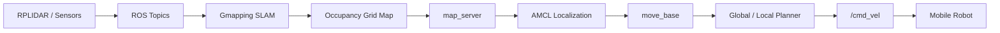

# ROS Mobile Robot Mapping & Navigation Practice

> BUPT Automation undergraduate robotics practice portfolio  
> Author: **陈炫樾 (CXuanyueee)**

本仓库整理自本人在《智能机器人创新实训》课程中完成的 ROS 移动机器人实验，重点展示 **ROS 节点通信、RPLIDAR 接入、Gmapping 建图、地图保存、AMCL 定位与 Navigation 自主导航** 的完整实践流程。

> **说明 / Note**
>
> 原实验运行在 Ubuntu 16.04 + ROS Kinetic 虚拟机/机器人环境中，原虚拟机源码目前未保留。本仓库根据本人已完成的实验过程、历史调试记录与课程实验流程重新整理，代码文件属于 **reconstructed portfolio version（重建作品集版）**，不是从原虚拟机直接导出的历史源码。

## Highlights

- Ubuntu 16.04 + ROS Kinetic
- Catkin workspace / ROS package 基础实践
- C++ Publisher / Subscriber
- RPLIDAR 与移动机器人硬件接入
- Gmapping 2D SLAM 建图
- `map_server` 地图保存
- AMCL 初始定位
- `move_base` / Navigation 自主导航
- RViz `2D Pose Estimate` / `2D Nav Goal`
- 串口、传感器、手柄、TF 与路径规划问题排查

## What I Actually Completed

本人在课程实践中实际完成/参与的内容包括：

1. 在 Ubuntu 16.04 / ROS Kinetic 环境下配置 catkin 工作空间并完成 ROS 基础节点实验；
2. 编写并运行 C++ 发布者 / 订阅者示例，理解 ROS Topic 通信机制；
3. 接入移动机器人与激光雷达，完成真实场地 SLAM 建图；
4. 使用 `map_server` 保存 `map.pgm` 与 `map.yaml`；
5. 加载已建地图，使用 AMCL 进行初始定位；
6. 在 RViz 中设置 `2D Pose Estimate` 与 `2D Nav Goal`，完成自主导航实验；
7. 在硬件实验过程中排查串口、激光雷达、手柄、TF、路径规划及供电相关问题；
8. 最终完成实物 SLAM 与自主导航验收。

## System Workflow

The following diagram summarizes the mobile robot mapping and autonomous navigation workflow practiced in this project.



The workflow covers sensor data acquisition, SLAM mapping, map storage, localization, path planning, and mobile robot motion control.

## Repository Structure

```text
ros-mobile-robot-navigation/
├── README.md
├── src/
│   ├── talker.cpp
│   ├── listener.cpp
│   └── simple_goal.cpp
├── scripts/
│   ├── check_devices.sh
│   ├── run_sim_mapping.sh
│   ├── run_real_mapping.sh
│   └── save_map.sh
├── docs/
│   ├── EXPERIMENT_LOG.md
│   ├── COMMANDS.md
│   └── TROUBLESHOOTING.md
├── maps/
│   └── README.md
└── assets/
    └── README.md
```

## Quick Reference

### 1. Start simulated mapping

```bash
source ~/wpb_ws/devel/setup.bash
roslaunch wpr_simulation wpb_robocup.launch
rosrun key_teleop key_teleop.py key_vel:=cmd_vel
roslaunch wpr_simulation wpb_gmapping.launch
```

### 2. Save map

```bash
rosrun map_server map_saver -f map
```

The command generates:

```text
map.pgm
map.yaml
```

### 3. Start navigation

Simulation:

```bash
source ~/wpb_ws/devel/setup.bash
roslaunch wpr_simulation wpb_navigation.launch
```

Real robot:

```bash
source ~/wpb_ws/devel/setup.bash
roslaunch wpb_home_tutorials nav.launch
```

Then in RViz:

1. Use **2D Pose Estimate** to correct the initial robot pose;
2. Check whether laser scan points align with the static map;
3. Use **2D Nav Goal** to set a navigation target;
4. Observe global path planning and robot motion.

## Reconstructed Code

`src/` contains small ROS examples rebuilt for this portfolio:

- `talker.cpp`: publishes `std_msgs/String` on `chatter`;
- `listener.cpp`: subscribes to `chatter`;
- `simple_goal.cpp`: sends a simple navigation goal through `move_base` actionlib.

These files are intended to demonstrate the concepts practiced in the course, not to claim recovery of the original VM source tree.

## Troubleshooting Experience

During the hardware practice I encountered and diagnosed issues including:

- serial device / permission problems;
- RPLIDAR binding failures;
- joystick device not appearing;
- RViz instability;
- TF extrapolation warnings;
- `Failed to get a plan` during navigation;
- localization mismatch between laser scans and the saved map;
- insufficient robot power affecting hardware behavior.

Details are recorded in [`docs/TROUBLESHOOTING.md`](docs/TROUBLESHOOTING.md).

## Environment

- Ubuntu 16.04
- ROS Kinetic
- ROS workspace: `~/catkin_ws`
- Robot workspace: `~/wpb_ws`
- C++ / roscpp
- RViz
- Gmapping
- AMCL / move_base
- RPLIDAR

## References

- BUPT course: 《智能机器人创新实训》实验指导书（2026）
- ROS Kinetic concepts and package APIs used in the course practice

---

This repository is maintained as a personal learning and job-search portfolio. It does not include proprietary code or third-party private project materials.
